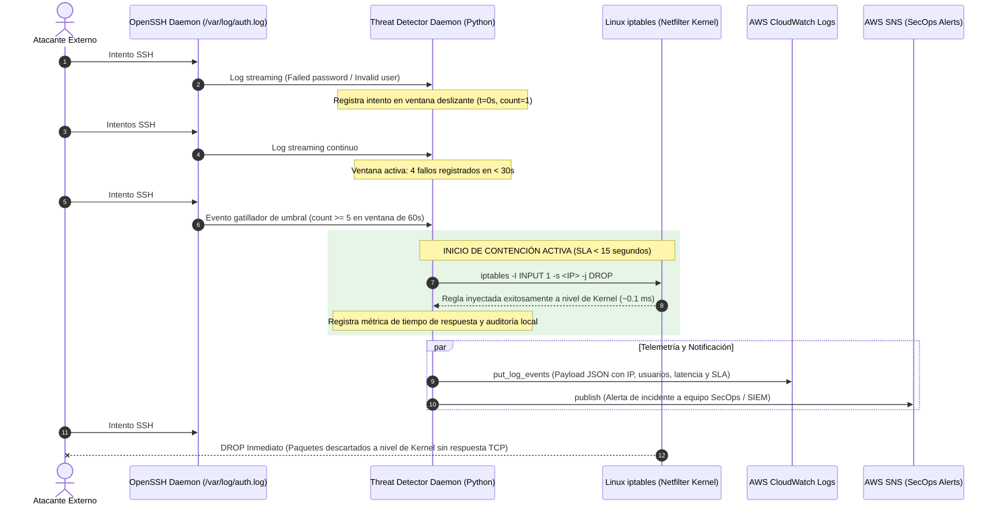

# Secure Cloud Infrastructure & Automated Active Defense (AWS + Terraform)

[](https://aws.amazon.com/architecture/well-architected/)
[](https://www.cisecurity.org/cis-benchmarks/)
[](https://www.terraform.io/)
[](https://www.python.org/)
[](LICENSE)

Repositorio de portafolio técnico de ingeniería en **Seguridad Cloud** y **DevSecOps**. Este proyecto demuestra el aprovisionamiento de una infraestructura en Amazon Web Services (AWS) con los más altos estándares de seguridad bajo el **AWS Well-Architected Framework (Security Pillar)** y el **CIS AWS Foundations Benchmark**, integrando **bastionado (hardening) automatizado en Linux** y un **agente de detección y mitigación activa de ataques de fuerza bruta en tiempo real (< 15 segundos)**.

---

## Tabla de Contenidos

- [1. Arquitectura de Seguridad](#1-arquitectura-de-seguridad)
- [2. Flujo de Detección y Mitigación Activa](#2-flujo-de-detección-y-mitigación-activa)
- [3. Matriz de Cumplimiento de Estándares (CIS Benchmarks)](#3-matriz-de-cumplimiento-de-estándares-cis-benchmarks)
- [4. Estructura del Repositorio](#4-estructura-del-repositorio)
- [5. Parámetros de Terraform (Variables y Outputs)](#5-parámetros-de-terraform-variables-y-outputs)
- [6. Guía de Despliegue Paso a Paso](#6-guía-de-despliegue-paso-a-paso)
- [7. Guía de Simulación de Ataque y Verificación de SLA](#7-guía-de-simulación-de-ataque-y-verificación-de-sla)
- [8. Modelo de Amenazas y Decisiones de Diseño](#8-modelo-de-amenazas-y-decisiones-de-diseño)
- [9. Destrucción de Recursos (Teardown)](#9-destrucción-de-recursos-teardown)

---

## 1. Arquitectura de Seguridad

La arquitectura implementa el principio de **Defensa en Profundidad (Defense-in-Depth)** mediante segmentación de red estricta, aislamiento de planos de control y datos, cifrado integral en reposo y tránsito, e identidades de mínimo privilegio:

```mermaid
flowchart TD
    subgraph Internet ["Perímetro Externo (Internet)"]
        Admin["SecOps Admin (IP Confiable / VPN)"]
        Attacker["Actor Malicioso (Ataque de Fuerza Bruta)"]
    end

    subgraph AWS_Cloud ["AWS Cloud (Región us-east-1)"]
        subgraph VPC ["VPC Segura (10.0.0.0/16)"]
            IGW["Internet Gateway"]
            
            subgraph Public_Subnet ["Subred Pública (10.0.1.0/24 - AZ A)"]
                NAT["NAT Gateway (Salida Controlada)"]
                Bastion["Host Bastion / Jump Host (Opcional)"]
            end

            subgraph Private_Subnet ["Subred Privada Protegida (10.0.10.0/24 - AZ A)"]
                subgraph Workload_EC2 ["Instancia EC2 Workload (Hardened)"]
                    Kernel["Linux Kernel (sysctl Hardened)"]
                    IPT["iptables Firewall (Default DROP)"]
                    Daemon["Threat Detector Daemon (Python 3)"]
                    SSH["OpenSSH (No Root / No Passwords)"]
                    EBS["Volumen Raíz EBS (Cifrado con KMS CMK)"]
                end
            end

            DefaultSG["Default SG (Completamente Sellado - CIS 5.4)"]
        end

        subgraph Security_Services ["Servicios Centralizados de Seguridad"]
            KMS["AWS KMS CMK (Rotación Anual Habilitada)"]
            CW_VPC["CloudWatch Logs (/aws/vpc-flow-logs)"]
            CW_App["CloudWatch Logs (/aws/ec2/threat-detector)"]
            SNS["AWS SNS (Tópico de Alertas de Seguridad)"]
            S3["Bucket S3 Confidencial (Cifrado KMS + TLS 1.2+)"]
        end
    end

    %% Flujos de Red
    Admin -->|SSH Port 22 Restringido| Bastion
    Bastion -->|SSH Salto Interno| SSH
    Attacker -.->|Intento No Autorizado| SSH
    VPC -.->|VPC Flow Logs Enriquecidos| CW_VPC
    NAT -->|Egress HTTPS 443 Exclusivo| IGW

    %% Controles Internos
    Daemon -->|Inyección DROP Inmediata| IPT
    Daemon -->|Eventos JSON Estructurados| CW_App
    Daemon -->|Notificación de Incidente| SNS
    Workload_EC2 -.->|IAM Least Privilege - Lectura| S3
    KMS -.->|Cifrado en Reposo| EBS
    KMS -.->|Cifrado en Reposo| S3
```



---

## 2. Flujo de Detección y Mitigación Activa

El agente `scripts/threat_detector.py` supervisa `/var/log/auth.log` en tiempo real mediante un generador de streaming continuo con tolerancia a la rotación de inodos (`logrotate`). Al superar el umbral de **5 intentos fallidos en 60 segundos**, activa la contención automática en milisegundos, cumpliendo holgadamente el SLA estipulado (< 15 segundos):



---

## 3. Matriz de Cumplimiento de Estándares (CIS Benchmarks)

| Estándar / Marco | Control / Recomendación | Implementación en este Repositorio | Archivo Fuente |
| :--- | :--- | :--- | :--- |
| **CIS AWS Foundations** | **2.1.1** Cifrado de almacenamiento S3 con KMS | Bucket S3 configurado con `SSE-KMS` mediante CMK administrada | [`terraform/iam.tf`](file:///terraform/iam.tf) |
| **CIS AWS Foundations** | **2.1.2** Bloqueo de acceso público en S3 | 4 directivas de `aws_s3_bucket_public_access_block` en `true` | [`terraform/iam.tf`](file:///terraform/iam.tf) |
| **CIS AWS Foundations** | **2.1.3** Forzar TLS 1.2+ en S3 | Política de bucket denegando solicitudes con `SecureTransport=false` y TLS < 1.2 | [`terraform/iam.tf`](file:///terraform/iam.tf) |
| **CIS AWS Foundations** | **2.8** Cifrado de volúmenes EBS en reposo | Cifrado obligatorio con KMS Customer Managed Key (`enable_key_rotation=true`) | [`terraform/ec2.tf`](file:///terraform/ec2.tf) |
| **CIS AWS Foundations** | **3.9** VPC Flow Logs habilitados | Flow Logs centralizados hacia CloudWatch Logs con agregación cada 60s | [`terraform/vpc.tf`](file:///terraform/vpc.tf) |
| **CIS AWS Foundations** | **5.4** Restringir Default Security Group | Default SG completamente sellado (cero reglas de entrada y salida) | [`terraform/security_groups.tf`](file:///terraform/security_groups.tf) |
| **CIS AWS Foundations** | **5.6** Forzar uso de IMDSv2 en EC2 | `http_tokens = "required"` y `http_put_response_hop_limit = 1` | [`terraform/ec2.tf`](file:///terraform/ec2.tf) |
| **AWS Well-Architected** | **SEC 03** Mínimo Privilegio en IAM | Cero políticas con `AdministratorAccess`, cero wildcards `*` en acciones | [`terraform/iam.tf`](file:///terraform/iam.tf) |
| **CIS Linux Benchmark** | **5.2.2** Deshabilitar autenticación root SSH | `PermitRootLogin no` en configuración drop-in de OpenSSH | [`scripts/harden_linux.sh`](file:///scripts/harden_linux.sh) |
| **CIS Linux Benchmark** | **5.2.3** Deshabilitar autenticación por clave | `PasswordAuthentication no` (solo autenticación por llave pública) | [`scripts/harden_linux.sh`](file:///scripts/harden_linux.sh) |
| **CIS Linux Benchmark** | **3.2.1** Deshabilitar reenvío y redirecciones | `net.ipv4.ip_forward = 0`, `net.ipv4.conf.all.accept_redirects = 0` | [`scripts/harden_linux.sh`](file:///scripts/harden_linux.sh) |
| **CIS Linux Benchmark** | **3.2.8** Mitigación SYN Flood | `net.ipv4.tcp_syncookies = 1` activado a nivel de kernel | [`scripts/harden_linux.sh`](file:///scripts/harden_linux.sh) |
| **CIS Linux Benchmark** | **3.5.1** Firewall por defecto DROP | Reglas iptables persistentes con política restrictiva (`INPUT DROP`) | [`scripts/harden_linux.sh`](file:///scripts/harden_linux.sh) |

---

## 4. Estructura del Repositorio

```text
secure-cloud-infra/
├── terraform/
│   ├── main.tf                    # Configuración de proveedores, versión mínima y tags globales
│   ├── vpc.tf                     # VPC modular, subredes multi-AZ, NAT GW y VPC Flow Logs
│   ├── iam.tf                     # IAM Roles de mínimo privilegio, Bucket S3 cifrado y SNS Topic
│   ├── security_groups.tf         # Security Groups sellados y reglas desacopladas anti-ciclos
│   ├── ec2.tf                     # EC2 Workload/Bastion, KMS CMK, IMDSv2 e inyección de user_data
│   ├── variables.tf               # Definición y validaciones de variables de infraestructura
│   ├── outputs.tf                 # Salidas formateadas (VPC ID, IPs, ARNs de seguridad)
│   └── terraform.tfvars.example   # Plantilla de variables documentada
├── scripts/
│   ├── harden_linux.sh            # Script de bastionado integral Linux bajo CIS Benchmark
│   └── threat_detector.py         # Daemon en Python de detección y mitigación activa (< 15s)
├── systemd/
│   └── threat-detector.service    # Unidad de servicio para ejecución continua resiliente
├── tests/
│   └── test_threat_detector.py    # Suite de pruebas unitarias y simulador de ataques de fuerza bruta
└── README.md                      # Documentación técnica y guía de operaciones
```

---

## 5. Parámetros de Terraform (Variables y Outputs)

### Variables Principales (`variables.tf`)

| Variable | Tipo | Default | Descripción |
| :--- | :--- | :--- | :--- |
| `aws_region` | `string` | `"us-east-1"` | Región de AWS donde se despliegan los recursos. |
| `environment` | `string` | `"production"` | Entorno de despliegue (`production`, `staging`, `dev`). |
| `vpc_cidr` | `string` | `"10.0.0.0/16"` | Bloque CIDR IPv4 para la VPC principal. |
| `public_subnet_cidrs` | `list(string)` | `["10.0.1.0/24", "10.0.2.0/24"]` | Subredes públicas para NAT Gateway y Bastion. |
| `private_subnet_cidrs`| `list(string)` | `["10.0.10.0/24", "10.0.11.0/24"]` | Subredes privadas para cargas de trabajo seguras. |
| `allowed_admin_cidrs` | `list(string)` | `[]` | Lista de IPs/CIDRs autorizados para acceso SSH (ej. `["203.0.113.25/32"]`). |
| `enable_bastion` | `bool` | `true` | Aprovisiona un host Bastion perimetral para salto seguro. |
| `instance_type` | `string` | `"t3.micro"` | Tamaño de cómputo EC2. |
| `brute_force_threshold` | `number` | `5` | Umbral de intentos fallidos antes de aplicar `DROP`. |
| `brute_force_window_seconds` | `number` | `60` | Tamaño de la ventana deslizante de correlación. |

### Outputs Principales (`outputs.tf`)

| Output | Descripción |
| :--- | :--- |
| `vpc_id` | Identificador de la VPC aprovisionada. |
| `nat_gateway_ip` | IP Elástica pública del NAT Gateway. |
| `bastion_public_ip` | IP Pública del host Bastion para ingreso administrativo. |
| `workload_private_ip` | IP Privada de la instancia asegurada. |
| `kms_cmk_arn` | ARN de la clave KMS Customer Managed Key empleada en cifrado. |
| `secure_s3_bucket_name` | Nombre del bucket S3 blindado. |
| `sns_alerts_topic_arn` | ARN del tópico SNS para suscripción de alertas de seguridad. |
| `threat_detector_log_group`| Nombre del Log Group en CloudWatch para eventos de contención. |

---

## 6. Guía de Despliegue Paso a Paso

### Prerrequisitos
- **Terraform** instalado (`>= 1.5.0`).
- **AWS CLI** configurado con credenciales válidas y permisos para aprovisionar VPC, EC2, IAM, KMS y CloudWatch.
- Un **Key Pair de AWS** creado en la región de despliegue si planea conectarse vía SSH tradicional (o use AWS Systems Manager Session Manager).

### Paso 1: Clonar el Repositorio
```bash
git clone https://github.com/italo04/secure-cloud-infra.git
cd secure-cloud-infra
```

### Paso 2: Configurar Variables de Despliegue
Cree su archivo `terraform.tfvars` a partir del ejemplo:
```bash
cp terraform/terraform.tfvars.example terraform/terraform.tfvars
```
Edite `terraform/terraform.tfvars` y defina su IP pública administrativa en `allowed_admin_cidrs`:
```hcl
allowed_admin_cidrs = [
  "203.0.113.25/32" # Reemplace con su IP real
]
ssh_key_name = "mi-clave-aws"
```

### Paso 3: Inicializar y Validar Terraform
```bash
cd terraform
terraform init
terraform validate
```

### Paso 4: Revisar el Plan de Ejecución
```bash
terraform plan -out=tfplan
```
Verifique que los recursos a crear coincidan con el diseño (VPC, Subredes, NAT GW, Flow Logs, KMS Key, IAM Roles, S3 Bucket y EC2).

### Paso 5: Aplicar la Infraestructura
```bash
terraform apply tfplan
```
Al finalizar, Terraform mostrará los valores de salida (`outputs`), incluyendo la IP pública del Bastion y la IP privada de la carga de trabajo.

---

## 7. Guía de Simulación de Ataque y Verificación de SLA

### Opción A: Simulación de Ataque Local / Integrada (Sin Despliegue en AWS)
El repositorio incluye un simulador de ráfagas de ataque de fuerza bruta que ejecuta el algoritmo en tiempo real y evalúa el cumplimiento del SLA de contención (< 15 segundos):

1. **Ejecutar suite de pruebas unitarias**:
   ```bash
   python3 -m unittest tests/test_threat_detector.py
   ```
2. **Ejecutar el simulador interactivo de ataque**:
   ```bash
   python3 tests/test_threat_detector.py --simulate-attack --ip 203.0.113.195
   ```
   **Salida Esperada:**
   ```text
   ===========================================================================
    [!] INICIANDO SIMULACIÓN DE ATAQUE DE FUERZA BRUTA SSH EN TIEMPO REAL
   ===========================================================================
   [*] IP Atacante Simulada:    203.0.113.195 (RFC 5737 TEST-NET-3)
   [*] Ráfaga de Intentos:      6 intentos secuenciales
   [*] Umbral de Detección:     > 5 fallos en 60s
   [*] SLA Máximo Permitido:    < 15.0 segundos
   ---------------------------------------------------------------------------
     -> [1/6] Intento SSH: user='root' IP=203.0.113.195 | Estado: 1 fallos registrados (0.02 ms)
     -> [2/6] Intento SSH: user='admin' IP=203.0.113.195 | Estado: 2 fallos registrados (0.06 ms)
     -> [3/6] Intento SSH: user='ubuntu' IP=203.0.113.195 | Estado: 3 fallos registrados (0.06 ms)
     -> [4/6] Intento SSH: user='test' IP=203.0.113.195 | Estado: 4 fallos registrados (0.08 ms)
     -> [5/6] Intento SSH: user='postgres' IP=203.0.113.195 | Estado: 5 fallos registrados (0.05 ms)
     -> [6/6] Intento SSH: user='guest' IP=203.0.113.195 | Estado: 5 fallos registrados (0.05 ms)
   ---------------------------------------------------------------------------
    [+] RESULTADOS DE LA MITIGACION:
     * Estado de la Deteccion:   EXITOSA (Bloqueo Gatillado en Intento #5)
     * Accion de Contencion:     IPTABLES_DROP (Regla inyectada en iptables INPUT)
     * Tiempo de Respuesta SLA:  0.05 ms  [CUMPLIDO (< 15s)]
     * Duracion Total del Flujo: 0.304 segundos
     * Usuarios Comprometidos:   root, test, admin, ubuntu, postgres
     * Carga JSON Generada:
    {
       "timestamp": "2026-09-23T23:22:01.468392+00:00",
       "event": "BRUTE_FORCE_BLOCKED",
       "host": "secure-node-01",
       "attacker_ip": "203.0.113.195",
       "failed_attempts": 5,
       "window_seconds": 60,
       "targeted_users": [
           "root",
           "test",
           "admin",
           "ubuntu",
           "postgres"
       ],
       "action": "IPTABLES_DROP",
       "mitigation_status": "SUCCESS",
       "response_time_ms": 0.05,
       "total_incident_duration_ms": 202.31,
       "sla_threshold_seconds": 15.0,
       "sla_met": true
   }
   ===========================================================================
    [OK] SIMULACION COMPLETADA SATISFACTORIAMENTE CONFORME AL SLA DE SEGURIDAD.
   ```

---

### Opción B: Verificación en Vivo sobre la Instancia Desplegada en AWS

1. **Conectarse a la instancia de trabajo mediante el Bastion**:
   ```bash
   ssh -A -i ~/.ssh/mi-clave.pem ubuntu@<BASTION_PUBLIC_IP>
   ssh ubuntu@<WORKLOAD_PRIVATE_IP>
   ```

2. **Verificar el estado del servicio systemd del detector**:
   ```bash
   sudo systemctl status threat-detector.service
   ```

3. **Simular intentos fallidos de autenticación SSH** (desde otra máquina o host):
   ```bash
   for i in {1..6}; do
     ssh -o ConnectTimeout=2 -o StrictHostKeyChecking=no invaliduser$i@<WORKLOAD_PRIVATE_IP> || true
   done
   ```

4. **Verificar la regla de bloqueo en iptables**:
   ```bash
   sudo iptables -L INPUT -n -v --line-numbers
   ```
   *Deberá observar la regla `DROP` inyectada en la primera posición con la IP origen bloqueada.*

5. **Inspeccionar el registro de auditoría estructurado**:
   ```bash
   sudo tail -n 1 /var/log/threat_detection.log | jq .
   ```

6. **Comprobar la telemetría en AWS CloudWatch Logs**:
   ```bash
   aws logs tail /aws/ec2/threat-detector --follow --format short
   ```

---

## 8. Modelo de Amenazas y Decisiones de Diseño

El diseño de seguridad fue modelado bajo la metodología **STRIDE**:

- **Spoofing (Suplantación)**:
  - Mitigado a nivel de red mediante `rp_filter = 1` (Reverse Path Filtering) en el kernel para evitar IP spoofing.
  - Autenticación SSH forzada exclusivamente por llaves asimétricas (`PasswordAuthentication no`).
- **Tampering (Manipulación)**:
  - Permisos restrictivos (`0640`, propiedad `root:adm`) en registros de auditoría (`/var/log/auth.log` y `/var/log/threat_detection.log`).
  - Cifrado en reposo obligatorio en todos los volúmenes EBS y objetos S3 con KMS CMK.
- **Repudiation (Repudio)**:
  - Registro exhaustivo mediante VPC Flow Logs centralizados y registro estructurado de eventos en CloudWatch Logs.
- **Information Disclosure (Fuga de Información)**:
  - Instancias de carga de trabajo confinadas en subredes privadas sin dirección IP pública.
  - Bloqueo total de acceso público en buckets S3 y forzado estricto de HTTPS (TLS 1.2+).
  - IMDSv2 requerido con `http_put_response_hop_limit = 1` para neutralizar ataques de Server-Side Request Forgery (SSRF).
- **Denial of Service (Denegación de Servicio)**:
  - Mitigación SYN Flood en kernel (`tcp_syncookies = 1`).
  - Bloqueo activo de IPs abusivas en iptables en menos de 15 segundos para proteger los sockets del demonio SSH.
- **Elevation of Privilege (Elevación de Privilegios)**:
  - Rol de IAM de mínimo privilegio sin comodines `*` ni directivas de superusuario.
  - Acceso SSH para usuario root deshabilitado (`PermitRootLogin no`).

---

## 9. Destrucción de Recursos (Teardown)

Para eliminar todos los recursos aprovisionados y evitar cargos no deseados en su cuenta de AWS:

```bash
cd terraform
terraform destroy -auto-approve
```

---

## Autor

**Lead Cloud Security & DevSecOps Engineer**  
- GitHub: [@italo04](https://github.com/italo04)  
- Repositorio: [secure-cloud-infra](https://github.com/italo04/secure-cloud-infra)
